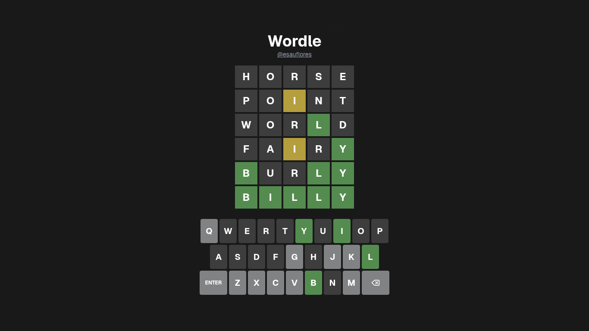

# Wordle

A Wordle clone built with Vite, React, and TypeScript.

<p align="center">
  
</p>

🌐 **[Live](https://wordle.esauflores.com/)**

## Tech Stack

- [Vite](https://vitejs.dev/) — Build tool
- [React 19](https://react.dev/) — UI library
- [TypeScript](https://www.typescriptlang.org/) — Type safety
- [Tailwind CSS](https://tailwindcss.com/) — Styling

## Getting Started

```bash
cd webapp
pnpm install
pnpm run dev
```

## Docker

```bash
cd webapp/infra
docker compose up
```

## Project Structure

```text
wordle/
└── webapp/          # Wordle web application
```

See [webapp/README.md](webapp/README.md) for full details, including:

- Architecture overview
- Game state and types
- Core game logic functions
- Links to live app and documentation

## Game Logic Overview

The game follows standard Wordle rules:

1. Correct letter in correct position → `correct`
2. Correct letter in wrong position → `present`
3. Letter not in target word (or extra duplicate) → `absent`

Keyboard hints are derived from past guesses with precedence:

`correct` > `present` > `absent` > `unknown`
